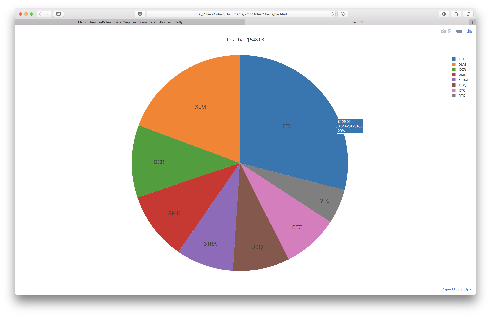

# BittrexCharts
Greetings und achtung to BittrexCharts, a wonderful and family friendly set of scripts for python3 that allow you to put your Bittrex API key to use. I grew tired of needing to authenticate my IP every time I wanted to check my wallet status (and I didn't like updating my portfolio in Blockfolio every time I made a trade), so now I use this. My life is much better now :)

**Note**: This key does *not* need trading permissions. Just let it read your coin balances. Also, because we're using plotly's *offline* mode, you shouldn't need to create an account with them.

So what does it look like? Currently, the only available chart is a **pie chart**:


## Installation
There are a few packages required for using this.  

```bash
$ pip install --upgrade git+https://github.com/ericsomdahl/python-bittrex.git
$ pip install plotly
$ pip install requests
```

## Usage
1. Put your API key information in `secrets.json`
2. `$ python charts.py`
3. If pie.html did not automagically open, open it in your favorite browser.
4. Enjoy!

## Credits
Special thanks to the people are plotly.

## TODO
- There are a number of other types of charts that I created for this, before Bittrex changed their API and broke everything. I'll probably fix those soon.